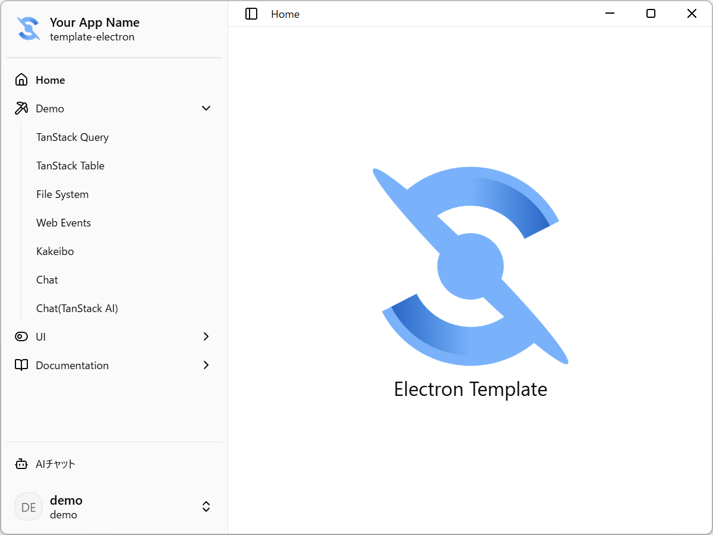

# Electron Template

Electron（Main/Preload）+ Vite（Renderer）構成のテンプレートです。React + TypeScript を前提に、TanStack Router/Query などのフロントエンド基盤と、electron-builder による配布ビルドまでを含みます。



## 特徴

- Renderer: Vite + React + TypeScript
- Routing/Data: TanStack Router / TanStack Query
- Styling: Tailwind CSS
- Desktop: Electron（Main/Preload）
- Build/Package: electron-builder
- Test: Vitest（jsdom）

## 動作環境

- Node.js（LTS推奨）
- pnpm

## セットアップ

```bash
pnpm install
```

## 開発（ホットリロード）

```bash
pnpm dev
```

## VS Code デバッグ（任意）

VS Code からデバッグ起動する場合、dev server の host/port が `package.json` の `debug.env.VITE_DEV_SERVER_URL`（デフォルト: `http://127.0.0.1:7777`）に合わせて起動します。

## ビルド（配布物作成）

```bash
pnpm build
```

生成物の例:

- `dist/`（Vite Renderer のビルド成果物）
- `dist-electron/`（Electron Main/Preload のビルド成果物）
- `release/`（electron-builder の成果物）

## よく使うコマンド

| コマンド      | 内容                                           |
| ------------- | ---------------------------------------------- |
| `pnpm dev`    | 開発サーバ起動（Vite）                         |
| `pnpm build`  | Renderer + Electron をビルドしてパッケージ作成 |
| `pnpm test`   | 型チェック + Vitest                            |
| `pnpm lint`   | 型チェック + ESLint                            |
| `pnpm format` | Prettierで整形                                 |
| `pnpm check`  | 型チェック + Prettier整形 + ESLint自動修正     |

## ディレクトリ構成

- `src/`：Renderer（React）
- `electron/main/`：Electron Main プロセス
- `electron/preload/`：Preload スクリプト
- `public/`：静的ファイル
- `data/`：SQLなど開発用データ（例: 初期化/サンプル）
- `dist/`：Vite Renderer のビルド成果物
- `dist-electron/`：Electronビルド出力（生成物）
- `release/`：配布用ビルド出力（生成物）

## トラブルシューティング

- `better-sqlite3` などのネイティブ依存が入るため、インストール後にビルドが必要になることがあります（本プロジェクトでは `postinstall` で `electron-builder install-app-deps` を実行します）。
- 依存関係が壊れた/再構築したい場合は、`pnpm install` のやり直しや、`dist-electron/`・`release/` の削除後に再ビルドを試してください。

## ライセンス

MIT License

## Shadcn

shadcn create のデザインを反映するために [https://github.com/shadcn-ui/ui](https://github.com/shadcn-ui/ui) を手動でコピー・調整しました。

Commit Hash: `9676c8f4ee4499da5714c4d1f9e630950b9192fa`

- `apps/v4/styles/globals.css` -> `src/styles.css`
- `apps/v4/styles/legacy-themes.css` -> `src/styles/legacy-themes.css`
- `apps/v4/registry/themes.ts` -> `src/features/style/components/themes.ts`
- `apps/v4/registry/bases/radix/ui/*.tsx` -> `src/components/ui/*.tsx`
- `apps/v4/registry/bases/radix/examples/*-example.tsx` -> `src/features/ui-demo/*-example.tsx`
- `apps/v4/registry/styles/style-vega.css` -> `src/styles/style-vega.css`
- `apps/v4/registry/styles/style-nova.css` -> `src/styles/style-nova.css`
- `apps/v4/registry/styles/style-lyra.css` -> `src/styles/style-lyra.css`
- `apps/v4/registry/styles/style-maia.css` -> `src/styles/style-maia.css`
- `apps/v4/registry/styles/style-mira.css` -> `src/styles/style-mira.css`
- `packages/shadcn/src/tailwind.css` -> `src/styles/tailwind.css`
- など

```plain
MIT License

Copyright (c) 2023 shadcn

Permission is hereby granted, free of charge, to any person obtaining a copy
of this software and associated documentation files (the "Software"), to deal
in the Software without restriction, including without limitation the rights
to use, copy, modify, merge, publish, distribute, sublicense, and/or sell
copies of the Software, and to permit persons to whom the Software is
furnished to do so, subject to the following conditions:

The above copyright notice and this permission notice shall be included in all
copies or substantial portions of the Software.

THE SOFTWARE IS PROVIDED "AS IS", WITHOUT WARRANTY OF ANY KIND, EXPRESS OR
IMPLIED, INCLUDING BUT NOT LIMITED TO THE WARRANTIES OF MERCHANTABILITY,
FITNESS FOR A PARTICULAR PURPOSE AND NONINFRINGEMENT. IN NO EVENT SHALL THE
AUTHORS OR COPYRIGHT HOLDERS BE LIABLE FOR ANY CLAIM, DAMAGES OR OTHER
LIABILITY, WHETHER IN AN ACTION OF CONTRACT, TORT OR OTHERWISE, ARISING FROM,
OUT OF OR IN CONNECTION WITH THE SOFTWARE OR THE USE OR OTHER DEALINGS IN THE
SOFTWARE.
```
