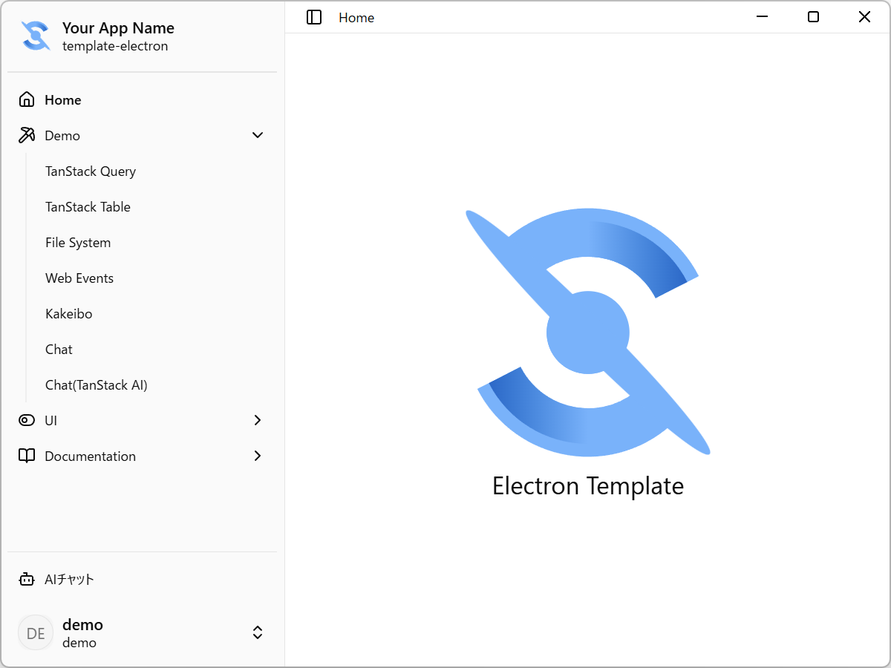
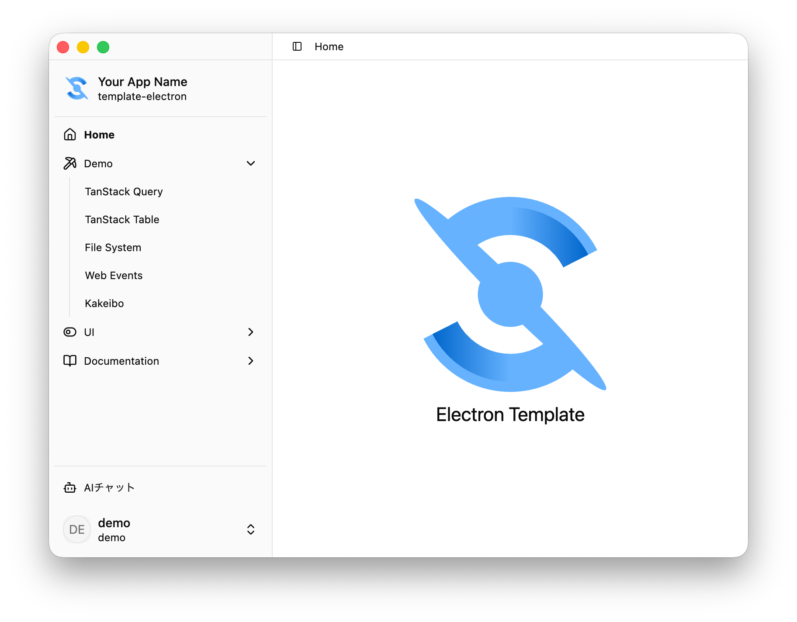

# Electron Template

Electron desktop app、Vite/React renderer、共有 TypeScript package をまとめた pnpm workspace のテンプレートです。TanStack Router/Query/AI、Tailwind CSS、electron-builder、SQLite 関連 package まで含めた monorepo 構成になっています。

| Screenshot (Windows)               | Screenshot (macOS)                         |
| ---------------------------------- | ------------------------------------------ |
|  |  |

## 特徴

- Monorepo: `apps/*` と `packages/*` を持つ pnpm workspace
- Renderer: Vite 8 + React 19 + TypeScript + TanStack Router/Query/AI
- Desktop: Electron 41（main / preload 分離）
- Shared packages: IPC、auth、RAG、sqlite abstraction、AI tooling
- Build/Package: electron-builder
- Test/Lint: Vitest、oxlint、oxfmt

## 動作環境

- Node.js（LTS 推奨）
- pnpm 10

## セットアップ

```bash
pnpm install
```

`apps/desktop` では `postinstall` で `electron-rebuild -f -w better-sqlite3` が実行され、native module を Electron 向けに再ビルドします。

## 開発起動

```bash
pnpm dev
```

ルートの `pnpm dev` は次を並列起動します。

- `apps/web`: Vite dev server
- `apps/desktop`: Electron app

個別に起動する場合:

```bash
pnpm --filter @your-app-name/web run dev
pnpm --filter your-app-name run dev
```

## ビルド

```bash
pnpm build
```

ルートの `pnpm build` は `apps/web` を先にビルドし、その成果物を使って `apps/desktop` をパッケージングします。

主な生成物:

- `apps/web/dist/`: renderer のビルド成果物
- `apps/desktop/dist/main/`: Electron main のビルド成果物
- `apps/desktop/dist/preload/`: preload のビルド成果物
- `apps/desktop/release/<version>/`: electron-builder の成果物

## よく使うコマンド

| コマンド | 内容 |
| --- | --- |
| `pnpm dev` | `apps/web` と `apps/desktop` を並列起動 |
| `pnpm build` | web をビルドしてから desktop をパッケージング |
| `pnpm test` | `test` script を持つ workspace のテストを実行 |
| `pnpm lint` | 各 workspace の lint/typecheck を実行 |
| `pnpm format` | `oxfmt` で整形 |
| `pnpm check` | 現状は `apps/desktop` の `check` を実行 |

変更範囲ごとの例:

```bash
pnpm --filter @your-app-name/web exec vitest run src/components/theme-provider.test.tsx
pnpm --filter @repo/auth run test
pnpm --filter @your-app-name/web run lint
pnpm --filter your-app-name run lint
```

## ディレクトリ構成

- `apps/web/`: renderer UI。routes、components、features、hooks、styles を持つ
- `apps/desktop/`: Electron main/preload、packaging、開発用 data、release 出力を持つ
- `apps/api/`: renderer 向け API 境界。Electron では `window.api`、browser/iframe では fallback/mock を扱う
- `packages/`: 共有 library 群。`ipc`、`auth`、`rag`、`sqlite`、`ai-tools` など
- `docs/`: スクリーンショットと補助ドキュメント

注意:

- `apps/web/src/routeTree.gen.ts` は TanStack Router の生成ファイルなので手編集しません。
- `apps/desktop/data/` は開発用 DB/SQL を持ち、package build 時には `extraResources` で同梱されます。

## テストと検証

- web テストは Vitest + `jsdom` を使用します。
- テストファイルは source の近くに `*.test.ts` / `*.test.tsx` として配置します。
- root `pnpm test` は `pnpm -r run test` なので、`test` script を持つ workspace だけが対象です。
- `apps/api` には standalone の `test` / `build` script がないため、変更時は `apps/web` など利用側で確認します。

## トラブルシューティング

- `better-sqlite3` のような native 依存で問題が出た場合は、まず `pnpm install` を再実行して Electron 向け rebuild をやり直します。
- パッケージ成果物の確認や再生成が必要な場合は、`apps/web/dist/`、`apps/desktop/dist/`、`apps/desktop/release/` を見直してから `pnpm build` を再実行します。
- DB ファイルや native module の packaging を変更する場合は、`apps/desktop/vite.config.ts` と `apps/desktop/electron-builder.json5` をセットで確認してください。

## ライセンス

MIT License
